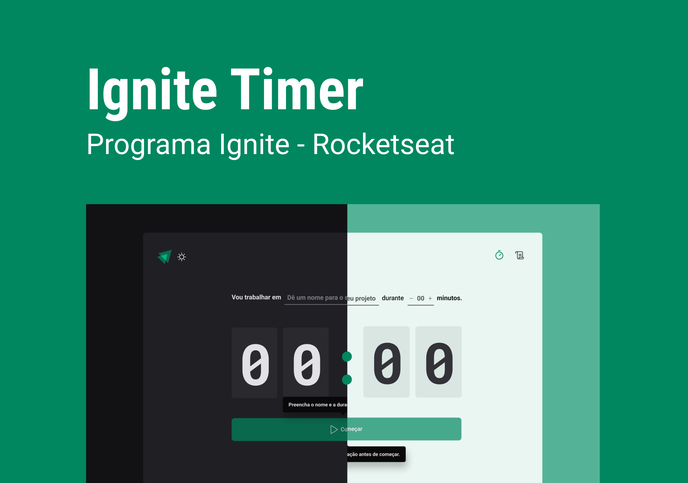

<h1 align="center">
    
    Ignite Timer ⏱️
</h1>

  <a href="#-tecnologias">Tecnologias</a>&nbsp;&nbsp;&nbsp;|&nbsp;&nbsp;&nbsp;
  <a href="#-projeto">Projeto</a>&nbsp;&nbsp;&nbsp;|&nbsp;&nbsp;&nbsp;
  <a href="#-layout">Layout</a>&nbsp;&nbsp;&nbsp;|&nbsp;&nbsp;&nbsp;
  <a href="#memo-licença">Licença</a>

O Ignite Timer é um projeto que permite ao usuário cronometrar suas tarefas do dia a dia, além de fornecer um histórico de todas as tarefas já realizadas. 📋

---

<h3>
Objetivos 🎯
</h3>

Os principais objetivos desta aplicação foram treinar o uso das seguintes ferramentas/tecnologias:

<ul>
<li>Lidar com datas e horários através da biblioteca date-fns 📅</li>
<li>Utilização de formulários com React Hook Form 📝</li>
<li>Aplicação de temas dark e light utilizando o Styled Components 🌗</li>
<li>Uso do hook useReducer do React para centralizar as alterações em um estado complexo 💡</li>
</ul>

---

## 📷 Demonstration

    

---

## 🚀 Tecnologias

Esse projeto foi desenvolvido com as seguintes tecnologias:

✔ [Vite](https://vitejs.dev/)
✔ [ReactJS](https://reactjs.org/)
✔ [TypeScript](https://www.typescriptlang.org/)
✔ [Styled Components](https://styled-components.com/docs)
✔ [Phosphor Icons](https://phosphoricons.com/)
✔ [date-fns](https://date-fns.org/docs/Getting-Started)
✔ [React Hook Form](https://react-hook-form.com/)
✔ [Zod](https://github.com/colinhacks/zod)
✔ [React Router](https://reactrouter.com/en/v6.3.0/getting-started/overview)
✔ [Immer](https://github.com/immerjs/immer)

---

## 🎨 Layout

Você pode visualizar o layout do projeto através [desse link](https://www.figma.com/file/nCeslCY32mG7newtwTpuks/Ignite-Timer-(Community)?node-id=11%3A599).

---

## Licença:

Esse projeto está sob a licença MIT.

---

## ✍ Author

    Feito com 💜 por Luciene Freitas

    
    

